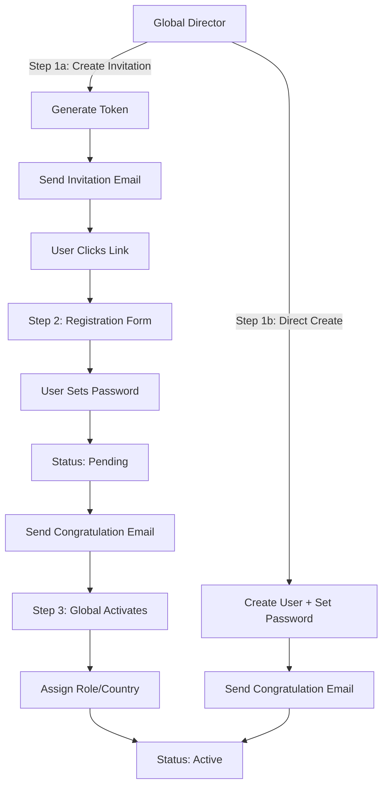

# Invitation-Based Authentication System

## Overview

Replace magic link authentication with invitation-only system. Global Directors must assign country before creating invitation links. Invitation links are country-bound, time-limited, and single-use. New users register via invitation links with password (country is pre-filled and locked). Global Directors activate users and assign roles/permissions. Magic link authentication is disabled for ALL users. Email service uses Supabase email.

## Architecture Changes

### Database Schema Updates

**New Migration:** `/db/migrations/002_invitation_auth_schema.sql`

1. **Add to users table:**

   - `phone` TEXT (optional, validated format)
   - `company` TEXT (optional)
   - `status` user_status enum (pending, active, inactive)
   - Remove default `is_active = true` (use status instead)
   - Add index on `status`

2. **Create user_status enum:**
   ```sql
   CREATE TYPE user_status AS ENUM ('pending', 'active', 'inactive');
   ```

3. **Create invitations table:**
   ```sql
   CREATE TABLE invitations (
     id UUID PRIMARY KEY DEFAULT gen_random_uuid(),
     token TEXT NOT NULL UNIQUE,
     email TEXT NOT NULL,
     country_id UUID NOT NULL REFERENCES locations(id), -- REQUIRED: Country must be assigned before creating invitation
     created_by UUID NOT NULL REFERENCES users(id),
     expires_at TIMESTAMPTZ NOT NULL,
     used_at TIMESTAMPTZ,
     created_at TIMESTAMPTZ NOT NULL DEFAULT NOW(),
     
     CONSTRAINT valid_expiration CHECK (expires_at > created_at)
   );
   
   CREATE INDEX idx_invitations_token ON invitations(token);
   CREATE INDEX idx_invitations_email ON invitations(email);
   CREATE INDEX idx_invitations_country_id ON invitations(country_id);
   ```

4. **Migration for existing users:**

   - Set all existing users to `status = 'active'`
   - Set `phone = NULL`, `company = NULL` for existing users
   - Add `is_active` computed column or migrate to status-based logic

### Authentication Flow



## Implementation Tasks

### Phase 1: Database Schema & Migration

**Files:**

- `/db/migrations/002_invitation_auth_schema.sql`
- Update `/lib/types/database.types.ts`

**Tasks:**

- [ ] Create `user_status` enum (pending, active, inactive)
- [ ] Add `phone` (TEXT, nullable) with validation constraint
- [ ] Add `company` (TEXT, nullable)
- [ ] Add `status` column (user_status, default 'pending')
- [ ] Create `invitations` table with token, email, country_id, created_by, expires_at, used_at
- [ ] Add indexes: `invitations(token)`, `invitations(email)`, `users(status)`
- [ ] Migration script for existing users (set status='active', phone=NULL, company=NULL)
- [ ] Update TypeScript types

### Phase 2: Invitation Service Layer

**Files:**

- `/lib/data-access/invitations.dal.ts`
- `/lib/services/invitations/invitation.service.ts`
- `/lib/validation/invitations.schema.ts`

**Tasks:**

- [ ] Create `invitations.dal.ts`:
  - `findByToken(token)` - Find invitation by token
  - `findByEmail(email)` - Find pending invitations for email
  - `insert(invitation)` - Create new invitation
  - `markAsUsed(token, usedAt)` - Mark invitation as used
  - `deleteExpired()` - Cleanup expired invitations
- [ ] Create `invitation.service.ts`:
  - `createInvitation(creatorId, email, countryId, expiresInDays?)` - **REQUIRE countryId** (validation), generate token, create invitation, send email via Supabase
  - `validateInvitation(token)` - Check if token is valid, not expired, not used
  - `getInvitationByToken(token)` - Fetch invitation details including country_id
  - `revokeInvitation(invitationId)` - Delete invitation
- [ ] Create `invitations.schema.ts`:
  - `createInvitationSchema` - email, **country_id (required)**, expires_in_days (optional, default 7)
  - Export TypeScript types

### Phase 3: User Registration Backend

**Files:**

- Update `/lib/data-access/users.dal.ts`
- Update `/lib/services/users/user.service.ts`
- Update `/lib/validation/users.schema.ts`
- `/lib/actions/auth.actions.ts` (new registration actions)

**Tasks:**

- [ ] Update `users.dal.ts`:
  - Update `insert()` to handle phone, company, status
  - Add `updateStatus(userId, status)`
- [ ] Update `user.service.ts`:
  - `createUserDirectly(creatorId, data, password)` - Create user with password, status='active', send congratulation email via Supabase
  - `registerWithInvitation(token, registrationData)` - Validate invitation, **get country_id from invitation**, create user with password and country_id, status='pending', mark invitation as used, send congratulation email via Supabase
  - `activateUser(creatorId, userId, role?, countryId?, regionId?)` - Update status to 'active', assign role/permissions
  - Update `createUser()` to use new direct creation flow
- [ ] Update `users.schema.ts`:
  - Add `phone` (optional, validated format: `^\+?[1-9]\d{1,14}$` for E.164)
  - Add `company` (optional, string)
  - Add `status` (user_status enum)
  - `registerWithInvitationSchema` - name, email, phone, company, password, token
  - `activateUserSchema` - userId, role, country_id, state_id, city_id
- [ ] Create registration actions in `auth.actions.ts`:
  - `registerWithInvitation(token, formData)` - Validate token, create user, send email
  - `validateInvitationToken(token)` - Check if token is valid
  - `activateUser(userId, formData)` - Global Director activates user

### Phase 4: Email Service Updates

**Files:**

- `/lib/services/email/email.service.ts`
- `/lib/services/email/templates.service.ts`

**Tasks:**

- [ ] Add to `email.service.ts` (using Supabase email):
  - `sendInvitationEmail(invitation, countryName)` - Send invitation link email via Supabase email service
  - `sendRegistrationCongratulationEmail(user)` - Send when user registers via Supabase email
  - `sendUserCreatedCongratulationEmail(user, creatorName)` - Send when Global creates user directly via Supabase email
- [ ] Add to `templates.service.ts`:
  - `renderInvitationEmail(invitation, countryName, link)` - HTML template with invitation link
  - `renderRegistrationCongratulation(user)` - Welcome email after registration
  - `renderUserCreatedCongratulation(user, creatorName)` - Welcome email when created by Global
- [ ] Email templates include:
  - Header with app branding
  - Clear call-to-action button
  - Expiration notice (for invitations)
  - Footer with support contact
- [ ] Configure Supabase email service in project settings

### Phase 5: Authentication UI Updates

**Files:**

- Update `/app/auth/login/page.tsx`
- `/app/auth/register/[token]/page.tsx` (new)
- Update `/app/auth/callback/route.ts`

**Tasks:**

- [ ] Update login page:
  - **Disable magic link authentication completely** (remove magic link functionality)
  - Replace with email/password login form
  - Add "Forgot password" link (future enhancement)
  - Add message: "Contact your administrator for an invitation link"
- [ ] Create registration page `/app/auth/register/[token]/page.tsx`:
  - Validate token on page load
  - Show error if token invalid/expired/used
  - **Fetch country_id from invitation** and pre-fill country field
  - Registration form: name, email (pre-filled, locked), phone (optional), company (optional), **country (pre-filled from invitation, locked/disabled)**, password, confirm password
  - Password requirements display
  - Submit → call `registerWithInvitation` action (passes country_id from invitation)
  - Success → show "Registration successful, awaiting activation" message
- [ ] Update callback route:
  - Check if user status is 'active' before allowing access
  - Redirect pending users to "awaiting activation" page
  - Redirect active users to dashboard

### Phase 6: User Management UI Updates

**Files:**

- Update `/app/(dashboard)/admin/users/page.tsx`
- Update `/components/users/UserFormDialog.tsx`
- `/components/users/CreateInvitationDialog.tsx` (new)
- `/components/users/ActivateUserDialog.tsx` (new)

**Tasks:**

- [ ] Update users page:
  - Add "Create Invitation" button (Global Director only)
  - Show user status badges (Pending/Active/Inactive)
  - Filter by status
  - Show phone and company columns
- [ ] Create `CreateInvitationDialog.tsx`:
  - Form: email, **country selector (REQUIRED - must select before creating)**, expiration days (default 7)
  - **Validate country is selected before allowing invitation creation**
  - Generate invitation link
  - Display link (copyable)
  - Send email button (sends via Supabase email)
- [ ] Update `UserFormDialog.tsx`:
  - Add phone field (optional, validated)
  - Add company field (optional)
  - When Global creates user directly: add password field, role selector, country/region/city selectors
  - User is immediately active when created directly
- [ ] Create `ActivateUserDialog.tsx`:
  - Show user details (name, email, phone, company, country)
  - Role selector (event_planner, city_curator, regional_curator, lead_curator)
  - Country/Region/City selectors
  - Activate button
- [ ] Add user actions:
  - "Activate" button for pending users
  - "Deactivate" button for active users
  - "Edit Profile" (update phone, company, role, location)

### Phase 7: Auth Utilities Updates

**Files:**

- Update `/lib/auth/server.ts`
- Update `/lib/auth/client.ts`

**Tasks:**

- [ ] Update `requireAuth()`:
  - Check `status = 'active'` (not just is_active)
  - Throw error if status is 'pending' or 'inactive'
- [ ] Add `requireActiveStatus()`:
  - Check user status is 'active'
- [ ] Update `getServerUser()`:
  - Include status in returned user object
- [ ] Remove `sendMagicLink()` function from client (magic link disabled for all users)
- [ ] Update login to use email/password authentication only

### Phase 8: Password Management

**Files:**

- `/lib/services/auth/password.service.ts` (new)
- Update Supabase Auth configuration

**Tasks:**

- [ ] Create `password.service.ts`:
  - `hashPassword(password)` - Hash password using Supabase Auth
  - `verifyPassword(userId, password)` - Verify password
  - `updatePassword(userId, newPassword)` - Update user password
  - `generateRandomPassword()` - Generate secure random password
- [ ] Configure Supabase Auth:
  - Enable email/password provider
  - **Disable magic link authentication completely**
  - Set password requirements (min length, complexity)

### Phase 9: Testing & Migration

**Tasks:**

- [ ] Write unit tests for invitation service
- [ ] Write unit tests for registration flow
- [ ] Write integration tests for full invitation → registration → activation flow
- [ ] Test direct user creation flow
- [ ] Test magic link is completely disabled
- [ ] Test email/password login works
- [ ] Test password validation
- [ ] Test invitation expiration and single-use enforcement
- [ ] Manual testing: Complete invitation workflow (country assignment → invitation → registration)
- [ ] Manual testing: Direct user creation workflow
- [ ] Migration testing: Existing users must reset password or use invitation system

### Phase 10: Documentation Updates

**Files:**

- Update `/docs/workflows.md`
- Update `/docs/architecture.md`

**Tasks:**

- [ ] Update `/docs/workflows.md`:
  - Document invitation-based authentication flow
  - Document country assignment requirement before invitation creation
  - Document registration process (country pre-filled and locked)
  - Document user activation process
- [ ] Update `/docs/architecture.md`:
  - Document authentication architecture changes
  - Document invitations table structure
  - Document status enum and user lifecycle

## Key Implementation Details

### Invitation Token Generation

- Use cryptographically secure random string (32+ characters)
- Store hashed token in database (security)
- Format: Base64URL encoded random bytes

### Password Requirements

- Minimum 8 characters
- At least one uppercase, one lowercase, one number
- Special characters recommended but not required

### Invitation Link Format

- `/auth/register?token={token}`
- Token validated server-side
- **Country is stored in invitations table and pre-filled in registration form (locked)**
- Single-use: marked as used immediately after successful registration
- Expiration: Configurable (default 7 days)

### Status Transitions

- `pending` → `active` (Global Director activation)
- `active` → `inactive` (Global Director deactivation)
- `inactive` → `active` (Global Director reactivation)

### Email Notifications

1. **Invitation Email**: Sent when Global creates invitation
2. **Registration Congratulation**: Sent when user completes registration (status: pending)
3. **User Created Congratulation**: Sent when Global creates user directly (status: active)

### Security Considerations

- Invitation tokens are single-use and time-limited
- Passwords are hashed using Supabase Auth
- **Magic link authentication disabled for ALL users**
- All user creation requires Global Director permission
- Invitation links are country-bound (country stored in invitations table, enforced in registration)
- Country must be assigned before invitation creation

## Dependencies

- Supabase Auth (email/password provider only)
- **Supabase email service** (for sending invitation and congratulation emails)
- Existing user management system
- Location/country data (locations table)

## Migration Strategy

1. Deploy database migration (adds new columns, preserves existing data)
2. Deploy backend services (invitation system, Supabase email integration)
3. Deploy frontend updates (registration page, user management, email/password login)
4. **Disable magic link authentication completely**
5. Existing users must use email/password login or be re-invited
6. All new users must use invitation system

## Rollback Plan

- Keep `is_active` column during transition
- Support both status-based and is_active-based checks
- Can re-enable magic link in Supabase Auth settings if needed (not recommended)